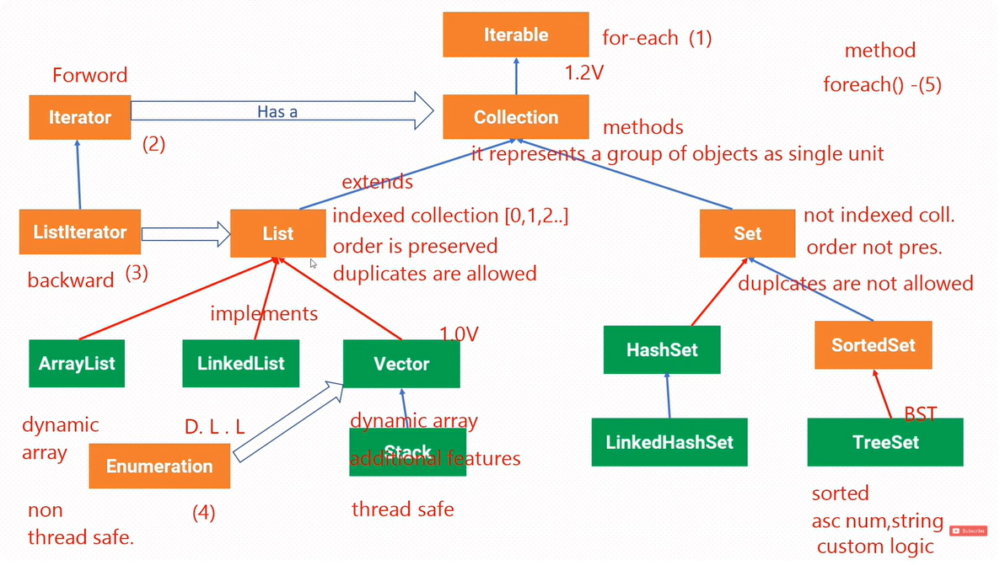
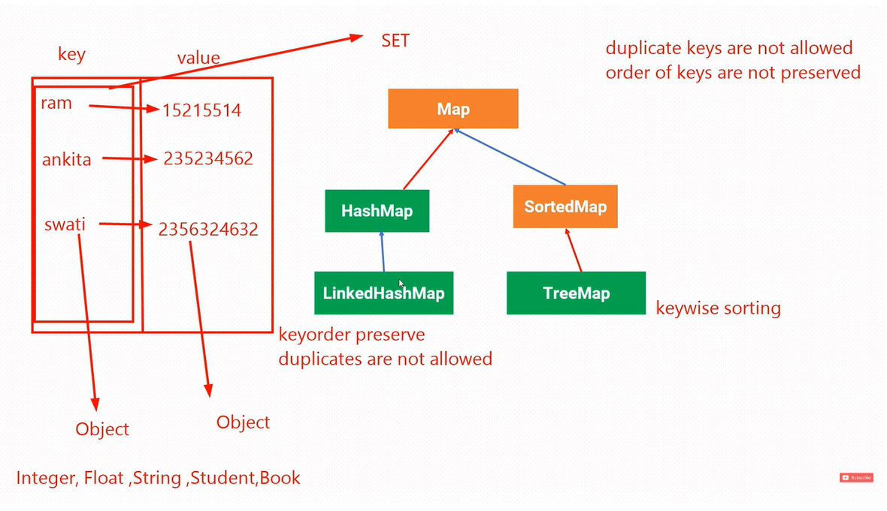

# Collection framework in java

### collection ?
- group of individual objects represented as a single unit.
- example - collection of books,bikes,stamps

### framework ?
- set of classes and interface which provide a ready-made structure.

## Collection framework?
- java api which provides architecture to **store** and __manipulate__ group of objects.

- Collection Framework is part of the java.util package.

### Key Classes and Interfaces and utility in the Collection Framework:
 **Interfaces:**
- Collection 
- List
- Set
- Queue
- Deque
- Map (Note: Map is technically not a subclass of Collection, but it's part of the framework)

**Classes:**

- ArrayList (implements List)
- LinkedList (implements List, Deque)
- HashSet (implements Set)
- TreeSet (implements Set)
- HashMap (implements Map)
- TreeMap (implements Map)
- PriorityQueue (implements Queue)

**Utility Classes:**

- Collections (contains static methods to operate on collections, such as sorting, searching, etc.)
- Iterator (interface for iterating over collections)

# Collection hierarchy

